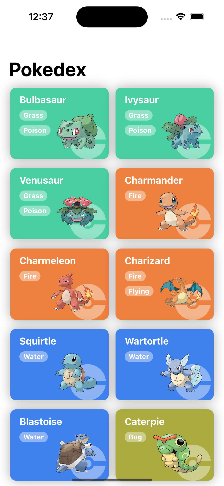
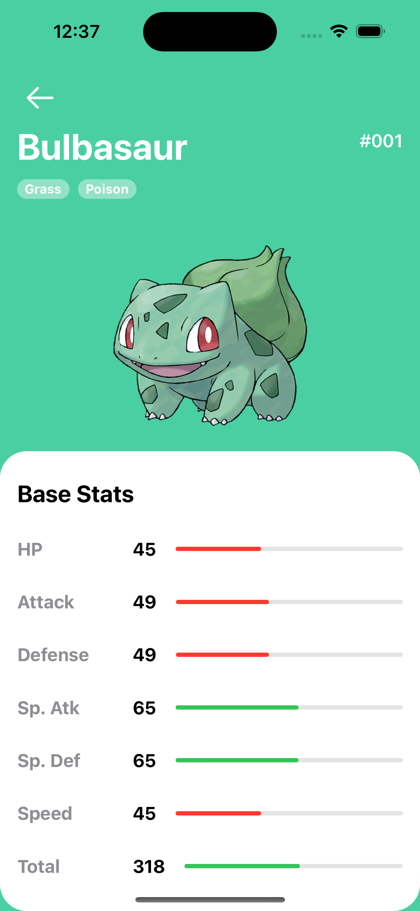

# Pokedex App

Screenshots:
| Home | Detail |
|-|-|
|||

## What is this app?

This app is a simple Pokedex app that uses the [PokeAPI](https://pokeapi.co/) to get the data for the Pokemon.

It can show all of the current pokemon and their sprites along with their types and stats on individual pages.

## Code Decisions

This small app was written using SwiftUI.

This was done because it is designed to be a quick test of skill to ensure that I know Swift and also how to interface with an API, especially given that this app requires a series of sequential API calls to get all of the data.

## Design Decisions

There is really only one main function that an app like this needs to do, and that is to display the data. The app is designed to be simple and easy to use, with a simple list of all of the Pokemon and a detail view for each Pokemon.

The UI was heavily inspired by [this design](https://dribbble.com/shots/6540871-Pokedex-App/attachments/6540871-Pokedex-App?mode=media) by [Saepul Nahwan](https://dribbble.com/sergeykoval).

## Technical Decisions

The API was designed as a simple wrapper around the PokeAPI. There is only one relevant function: `getFullPokemon()`. This function returns an array of `pokemonList` structs that each have a `pokemon` struct inside of them. This is done because the API returns a list of Pokemon and then a separate call is required to get the full data for each Pokemon.

The `pokemon` struct is a simple struct that contains all of the data for a single Pokemon. It contains the name, the sprite, the types, and the stats.

There is also a `loadMore()` function that is used to load more Pokemon when the user scrolls to the bottom of the list. This is done to prevent the app from making too many API calls at once. The app loads 20 Pokemon at a time, and then loads more when the user scrolls to the bottom of the list. This is done by using a `LazyVStack` and checking when the last item in the list becomes visible.

In terms of caching the results, the textual pokemon data themselves aren't cached, but the images are. This is done by using the `AsyncImageCache` class. The `URL` is used as the key, and the image is stored in the cache. This is done because the images are the only thing that take a long time to load, and the images are the same for each Pokemon. The textual data is very small and doesn't take long to load, so it isn't worth the effort to cache it for such a small project.

## Todos:

- [ ] Add logical tests for all the functions in the Pokedex module.
- [ ] Add snapshot tests for all the views in the Pokedex module.
  - [ ] Add snapshot tests for phones of different sizes
- [ ] Add a search bar and filters to the Pokedex view.
